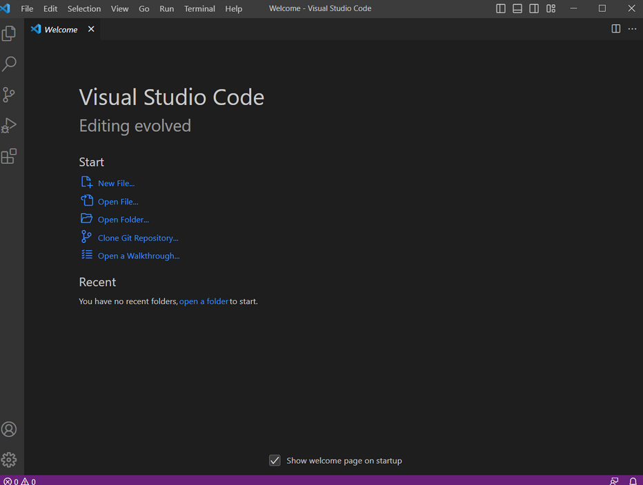
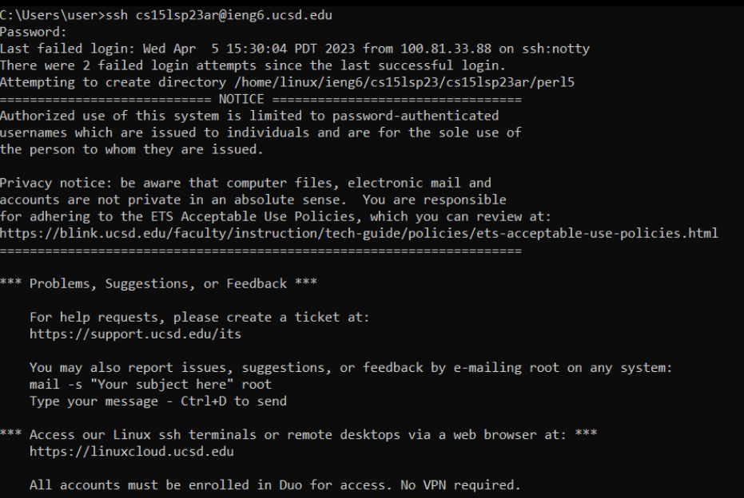

How to log in to a course-specific account on ieng6

First, download Visual Studio Code and open it. This should look like the picture below.

Additionally, install git if you haven't already.
Then, open a terminal in VSCode. This can be done with Terminal -> New Terminal. Enter the following command:
ssh cs15lsp23xx@ieng6.ucsd.edu

But replace 'xx' with the numbers that match your own account. Enter your password, say yes to any confirmation, and you should see something that looks like this:

You can try exploring the directories and running commands, as shown below:

