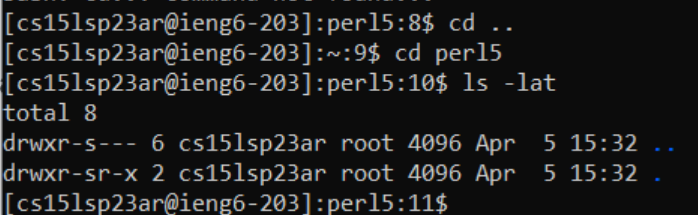

How to log in to a course-specific account on ieng6

#Downloading Visual Studio Code

First, download Visual Studio Code and open it. It can be found on https://code.visualstudio.com/ 
Once it's installed, it should look like the picture below.

#Logging in

Additionally, install git if you haven't already. (https://git-scm.com/downloads)
Then, open a terminal in VSCode. This can be done with Terminal -> New Terminal. Enter the following command:
`ssh cs15lsp23xx@ieng6.ucsd.edu`

But replace 'xx' with the numbers that match your own account.
You can find your account with this link: https://sdacs.ucsd.edu/~icc/index.php 
Enter your password, say yes to any confirmation, and you should see something that looks like this:

#Running commands

You can try exploring the directories and running commands, as shown below:

In this example, `cd` is used to change directories. Giving it `..` moves the working directory 1 folder back. The next command moves the working directory into a folder called "per15". `ls` lists all files in the current directory. The `-lat` arguments orders the files by modification time.
You can try additional commands, such as:
`pwd` - prints the current working directory
`scp` - used to copy files onto the server
`mkdir` - creates a directory
