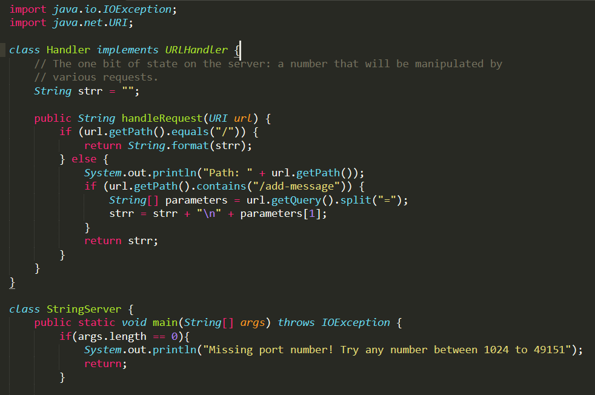
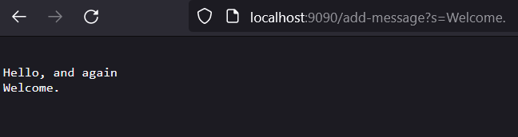
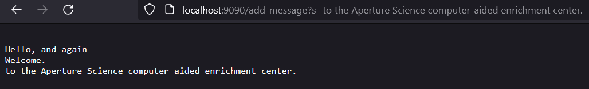
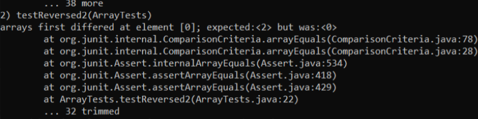
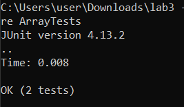

# Part 1

This is the code for StringServer:



Here are examples of its usage:




In both examples, a method that gets called is `handleRequest`. It takes the URL as an argument. The values passed are as follows:

First example -- localhost:9090/add-message?s=Welcome.

Second example -- localhost:9090/add-message?s=to the Aperture Science computer-aided enrichment center.


`getPath()` is also called. In both instances, it returns `/add-message`.

`getQuery()` is called too. In the first example, it returns `s=Welcome.`. In the second example, it returns `s=to the Aperture Science computer-aided enrichment center.`

There is a field called `strr` that is the string that gets displayed on the webpage. In the first example, "Welcome." is added to the string in a new line. In the next example, "to the Aperture Science computer-aided enrichment center." is once again added as a new line.

# Part 2

The "reversed" method is bugged when inputting almost any value, for instance, `{1, 2}` returns something with the value of 0 index 0:

```
@Test
  public void testReversed2() {
    int[] input1 = {1, 2};
    assertArrayEquals(new int[]{2, 1}, ArrayExamples.reversed(input1));
  }
```
  


Inputting an empty `{ }` array does not cause an error, however:

```
@Test
  public void testReversed() {
    int[] input1 = { };
    assertArrayEquals(new int[]{ }, ArrayExamples.reversed(input1));
  }
```



This error is happening because the array is modifying itself as the method runs, returning inaccurate results. The program even has a `newArray` variable, indicating that the new and old arrays were intended to be separate. However, this is not the variable that is being modified or returned.

Old code:

```
static int[] reversed(int[] arr) {
    int[] newArray = new int[arr.length];
    for(int i = 0; i < arr.length; i += 1) {
      arr[i] = newArray[arr.length - i - 1];
    }
    return arr;
  }
```

Fixed code:

```
static int[] reversed(int[] arr) {
    int[] newArray = new int[arr.length];
    for(int i = 0; i < arr.length; i += 1) {
      newArray[i] = arr[arr.length - i - 1];
    }
    return newArray;
  }
```

# Part 3

Something new I learned was learning how to host a web server in Lab 2, at least on a local PC. I've had experiences running webpages like that before, but not on as low of a level as this. Seeing how to directly parse and respond to requests made to the site was new to me.
