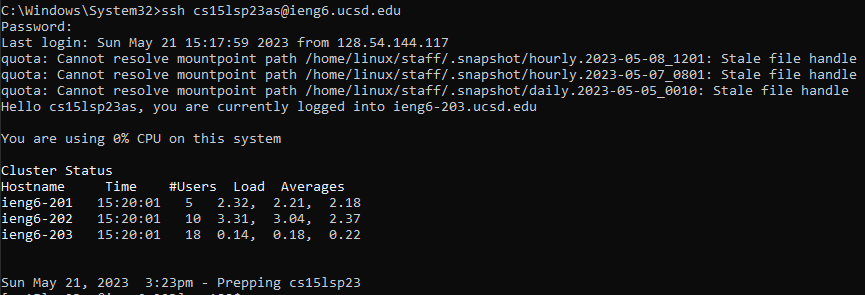
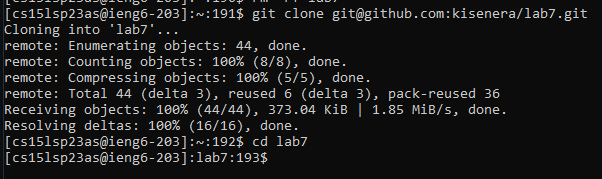
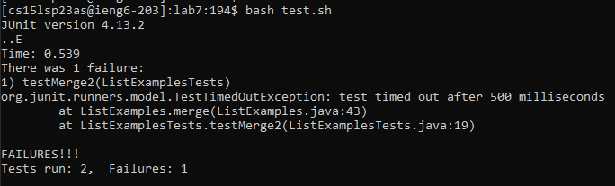
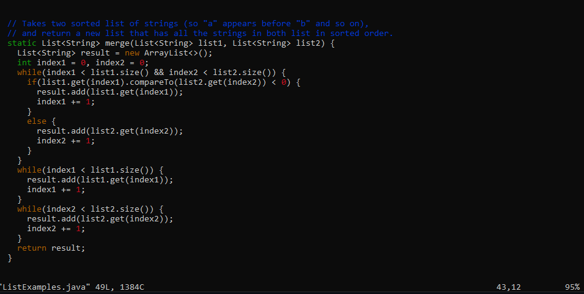
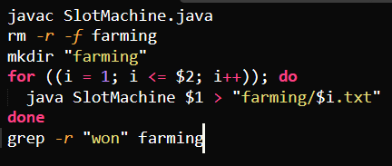
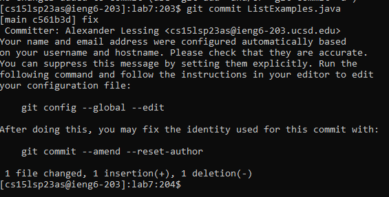
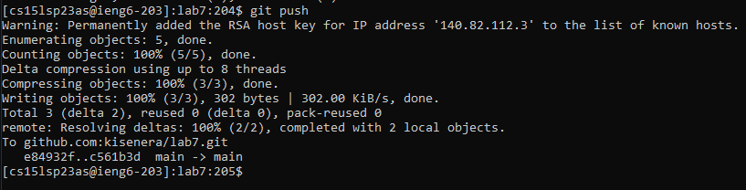

1. ssh cs15lsp23as@ieng6.ucsd.edu

This logs into the server where everything will be done.

2a. git clone git@github.com:kisenera/lab7.git

2b. cd lab7

This clones my fork of the repository, and then makes it the current working directory.

3. bash test.sh

The test script runs, showing that the code has errors.

4a. vim TestExamples.java

4b. /index1 +=;

4c. `<enter>`
  
4d. n (x2)

4e. 6
  
4f. `<right arrow>`
  
4g. I
  
4h. `<backspace>`
  
4i. 2
  
4j. `<esc>`
  
4k. :wq

To get to the problematic line, we use `/` to find instances of "index 1 +=;" It is down two from the start, so n is pressed twice. 6 plus the right arrow moves the cursor to the number that needs to be changed. Insert mode is entered, and it is modified to the correct value. Normal mode is entered once again and the file is saved and closed.

  
5.\ bash test.sh

The tests are run again, and this time they pass.

6a. git commit ListExamples.java
  
6b. I
  
6c. fix
  
6d. :wq

The changes to the file are committed to the repository. Insert mode is entered to write 'fix' as the commit message, which is then saved and closed.
  

  
7.\ git push

Finally, the changes are pushed.
  

