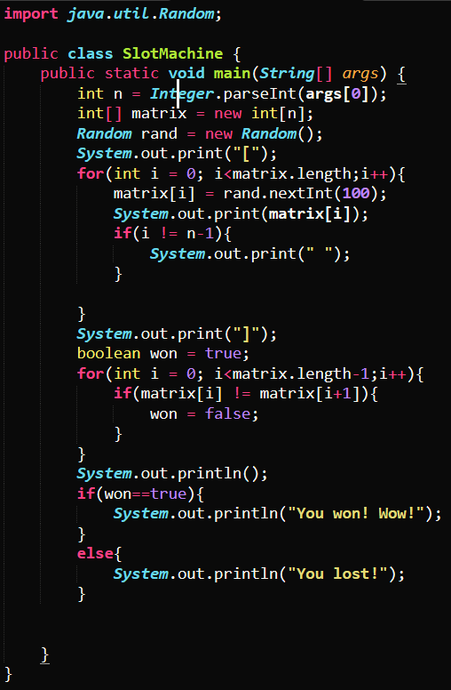
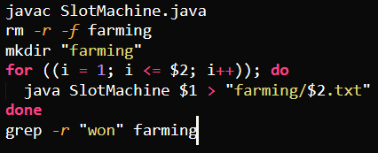
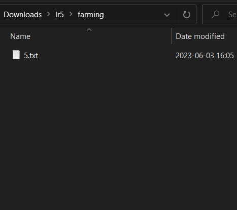

# Student Edstem post
**What environment are you using (computer, operating system, web browser, terminal/editor, and so on)?**

I am using Windows 10 with Windows subsystem for Linux (WSL), and Sublime Text.

**Detail the symptom you're seeing. Be specific; include both what you're seeing and what you expected to see instead. Screenshots are great, copy-pasted terminal output is also great. Avoid saying “it doesn't work”.**

I have a bash script that runs a java script repeatedly (number specified by user). It is supposed to create a new unique text file for each output, however, it only makes one for the last run.

The java script is a slot machine that generates an n-long sequence of numbers. If they are all equal, it prints that the user has won.

The bash script runs the java program the number of times equal to the second argument, using sequences with length equal to the first argument. Each run's output is logged as a .txt file in the "farming" directory, and afterwards, the user is notified if any of their runs resulted in a winning combination.

As can be seen, only the last file made is written. The contents seem correct, though:

**Detail the failure-inducing input and context. That might mean any or all of the command you're running, a test case, command-line arguments, working directory, even the last few commands you ran. Do your best to provide as much context as you can.**

`bash farm.sh 2 5` is run in the same directory as the scripts. This command runs `java SlotMachine 2` 5 times. It seems like some part of the for loop is messed up?

# TA Response

Yes, the fact that the java program seems to run correctly but the text files aren't created properly indicates a problem with your bash script. I would suggest taking a closer look at your output redirection, how are you naming these files?

# Student Response

Oh, thank you! I was accidentally using a bash argument as the filename. This remains static throughout runs, so the files overwrite each other. I changed the filename to be equal to the current loop index, and it works now:

Also, I seem to have gotten extremely lucky :)

